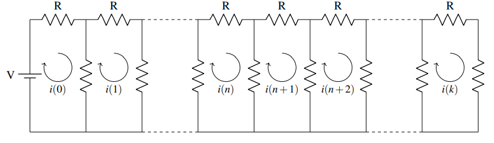

# Trabalho de Conclusão de Curso - Bacharelado em Ciência e Tecnologia

### UNIVERSIDADE FEDERAL RURAL DO SEMI-ÁRIDO - UFERSA

### APLICAÇÃO DA TRANSFORMADA Z NA ANÁLISE DE CIRCUITOS ELÉTRICOS DISCRETOS

### RESUMO

Este trabalho analisa a aplicação da Transformada Z na resolução de circuitos elétricos discretos,
com foco em ladder networks. A Transformada Z permite converter equações de diferenças
em expressões algébricas, facilitando a modelagem e a previsão do comportamento dinâmico
dos circuitos. Foram utilizadas as Leis de Kirchhoff e a Lei de Ohm para formular as equações
dos circuitos, resolvidas no domínio da Transformada Z. A metodologia incluiu simulações
computacionais no software Multisim e a implementação de um programa em Python para
automatizar os cálculos. Os resultados mostraram forte correlação entre os valores teóricos
e simulados, validando a eficácia do método. Os resultados ressaltam a aplicabilidade da
Transformada Z na análise de circuitos elétricos e destacam sua utilidade na otimização de
processos de modelagem matemática.

### Tecnologias
- <a href="https://www.ni.com/en/support/downloads/software-products/download.multisim.html?srsltid=AfmBOop9PxlwMzHdw5kAutv0n2epTl-sdp9BrvFQSqYeNyDg4yd3rbz7#452133" target="_blank">Multisim</a>
- <a href="https://www.python.org/" target="_blank">Python</a>

### Bibliotecas
- <a href="https://numpy.org/" target="_blank">Numpy</a>
- <a href="https://matplotlib.org/" target="_blank">Matplotlib</a>

Desenvolvido por Enthony Araujo

